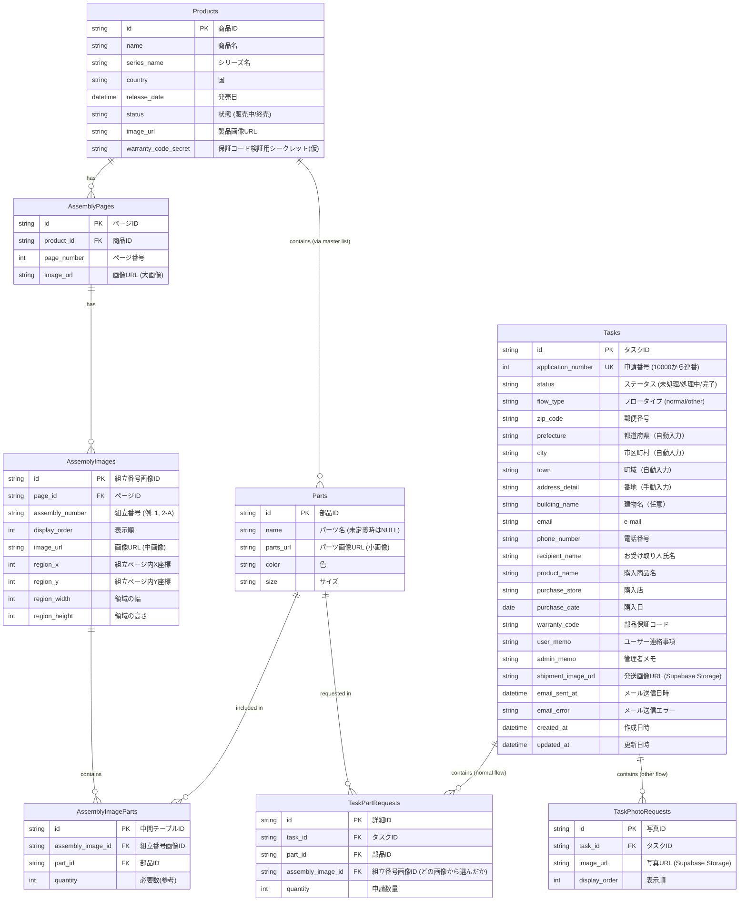

# データベース設計書

## 1. ER図



## 2. テーブル定義

### 2.1 Products (商品マスタ)
| カラム名 | データ型 | 制約 | 説明 |
| --- | --- | --- | --- |
| id | VARCHAR(50) | PK | 商品ID |
| name | VARCHAR(255) | NOT NULL | 商品名 |
| series_name | VARCHAR(100) | NOT NULL | シリーズ名 |
| country | VARCHAR(50) | NOT NULL | 国 |
| release_date | DATE | | 発売日 |
| status | VARCHAR(20) | NOT NULL | 販売ステータス |
| image_url | TEXT | | 製品画像URL (Supabase Storage) |

### 2.2 AssemblyPages (組立ページマスタ)
| カラム名 | データ型 | 制約 | 説明 |
| --- | --- | --- | --- |
| id | VARCHAR(50) | PK | ページID |
| product_id | VARCHAR(50) | FK | 商品ID |
| page_number | INT | NOT NULL | ページ番号 |
| image_url | TEXT | NOT NULL | 画像URL (大画像) |

### 2.3 AssemblyImages (組立番号画像マスタ)
| カラム名 | データ型 | 制約 | 説明 |
| --- | --- | --- | --- |
| id | VARCHAR(50) | PK | 画像ID |
| page_id | VARCHAR(50) | FK | ページID |
| assembly_number | VARCHAR(20) | NOT NULL | 組立番号 |
| display_order | INT | NOT NULL | 表示順 |
| image_url | TEXT | NOT NULL | 画像URL (中画像) |
| region_x | INT | | 組立ページ画像内での左上X座標（ピクセル） |
| region_y | INT | | 組立ページ画像内での左上Y座標（ピクセル） |
| region_width | INT | | 領域の幅（ピクセル） |
| region_height | INT | | 領域の高さ（ピクセル） |

### 2.4 Parts (部品マスタ)
| カラム名 | データ型 | 制約 | 説明 |
| --- | --- | --- | --- |
| id | VARCHAR(50) | PK | 部品ID |
| name | VARCHAR(100) | | パーツ名 (未定義時はNULL) |
| parts_url | TEXT | | パーツURL (小画像) |
| color | VARCHAR(50) | | 色 |
| size | VARCHAR(50) | | サイズ |

### 2.5 AssemblyImageParts (組立番号-部品 中間テーブル)
| カラム名 | データ型 | 制約 | 説明 |
| --- | --- | --- | --- |
| id | VARCHAR(50) | PK | 中間テーブルID |
| assembly_image_id | VARCHAR(50) | FK | 組立番号画像ID |
| part_id | VARCHAR(50) | FK, NULL許可 | 部品ID（未割当時はNULL） |
| quantity | INT | DEFAULT 1 | 必要数（参考値） |
| display_order | INT | NOT NULL, DEFAULT 1 | 部品の表示順（1から開始） |
| created_at | TIMESTAMPTZ | DEFAULT NOW() | 作成日時 |

### 2.6 Tasks (申請タスク)
| カラム名 | データ型 | 制約 | 説明 |
| --- | --- | --- | --- |
| id | VARCHAR(50) | PK | タスクID (UUID) |
| application_number | INT | UNIQUE, DEFAULT nextval() | 申請番号（10000から始まる連番） |
| status | VARCHAR(20) | NOT NULL, DEFAULT 'pending' | ステータス (pending, processing, completed, cancelled) |
| flow_type | VARCHAR(20) | NOT NULL, DEFAULT 'normal' | フロータイプ ('normal': パーツ選択, 'other': パーツ写真) |
| zip_code | VARCHAR(10) | NOT NULL | 郵便番号 |
| prefecture | VARCHAR(10) | NOT NULL | 都道府県（郵便番号から自動入力） |
| city | VARCHAR(100) | NOT NULL | 市区町村（郵便番号から自動入力） |
| town | VARCHAR(100) | | 町域（郵便番号から自動入力） |
| address_detail | VARCHAR(255) | NOT NULL | 番地（手動入力・必須） |
| building_name | VARCHAR(255) | | 建物名（手動入力・任意） |
| email | VARCHAR(255) | NOT NULL | メールアドレス |
| phone_number | VARCHAR(20) | NOT NULL | 電話番号 |
| recipient_name | VARCHAR(100) | NOT NULL | 受取人氏名 |
| product_name | VARCHAR(255) | NOT NULL | 購入商品名(申請時スナップショット) |
| purchase_store | VARCHAR(255) | NOT NULL | 購入店 |
| purchase_date | DATE | NOT NULL | 購入日 |
| warranty_code | VARCHAR(50) | NOT NULL | 保証コード |
| user_memo | TEXT | | ユーザー連絡事項 |
| admin_memo | TEXT | | 管理者メモ |
| shipment_image_url | TEXT | | 発送画像URL (Supabase Storage) |
| email_sent_at | TIMESTAMPTZ | | メール送信日時 |
| email_error | TEXT | | メール送信エラーメッセージ |
| created_at | TIMESTAMPTZ | DEFAULT NOW() | 作成日時 |
| updated_at | TIMESTAMPTZ | DEFAULT NOW() | 更新日時 |

**申請番号について：**
- PostgreSQLのSEQUENCE `task_application_number_seq` により自動採番
- 10000から開始し、1ずつインクリメント
- 人間が視覚的に管理しやすい連番として使用

**フロータイプについて：**
- `normal`: 通常フロー（製品一覧から選択し、パーツを選択して申請）
- `other`: その他フロー（製品一覧にない場合、写真をアップロードして申請）

**住所フィールドについて：**
- 郵便番号入力時にZipCloud APIを使用して自動入力
- `prefecture`, `city`, `town`: 自動入力（ユーザー編集可能）
- `address_detail`: 番地（ユーザー手動入力・必須）
- `building_name`: 建物名・部屋番号（ユーザー手動入力・任意）
- 1つの郵便番号で複数住所がヒットする場合は、ユーザーが選択

### 2.7 TaskPartRequests (申請パーツリクエスト - 通常フロー用)
| カラム名 | データ型 | 制約 | 説明 |
| --- | --- | --- | --- |
| id | VARCHAR(50) | PK, DEFAULT uuid_generate_v4() | リクエストID |
| task_id | VARCHAR(50) | FK | タスクID |
| part_id | VARCHAR(50) | FK | 部品ID |
| assembly_image_id | VARCHAR(50) | FK | 選択元画像ID |
| quantity | INT | NOT NULL | 申請数量 |
| created_at | TIMESTAMPTZ | DEFAULT NOW() | 作成日時 |

通常フロー（`flow_type = 'normal'`）で使用されるテーブル。ユーザーが製品一覧から製品を選択し、組立画像から部品を選択して申請する際に、選択した部品情報を格納します。

### 2.8 TaskPhotoRequests (申請写真リクエスト - その他フロー用)
| カラム名 | データ型 | 制約 | 説明 |
| --- | --- | --- | --- |
| id | VARCHAR(50) | PK, DEFAULT uuid_generate_v4() | リクエストID |
| task_id | VARCHAR(50) | FK | タスクID |
| image_url | TEXT | NOT NULL | 印付き写真URL (Supabase Storage) |
| display_order | INT | NOT NULL, DEFAULT 1 | 表示順 |
| created_at | TIMESTAMPTZ | DEFAULT NOW() | 作成日時 |

その他フロー（`flow_type = 'other'`）で使用されるテーブル。製品一覧にない製品の場合、ユーザーが不足部品の写真を撮影・アップロードし、印を付けて申請する際に、アップロードした写真情報を格納します。

## 3. 設計についての補足

### 3.1 AssemblyImageParts（中間テーブル）の設計理由

`Parts`テーブルと`AssemblyImages`テーブルの間に中間テーブル`AssemblyImageParts`を設けている理由は、**部品のマスタ化と再利用**を将来的に可能にするためです。

#### 現在の運用
- 各組立番号画像から切り出した部品画像は、その組立番号専用として登録
- 同じ形状の部品でも、組立番号ごとに別レコードとして登録

#### 将来的な拡張可能性
1. **部品の共通化・マスタ化**
   - 同じネジ、同じパーツが複数の組立番号で使用されるケースに対応
   - 例：「M3ネジ」という部品マスタを作成し、組立番号1と組立番号5の両方から参照

2. **数量管理**
   - `quantity`フィールドにより、「この組立番号ではこの部品を何個使用するか」を管理可能
   - 部品請求時の参考情報として活用

3. **部品情報の一元管理**
   - 部品の色、サイズ、名称などの情報を一箇所で管理
   - 複数の組立番号から参照される部品の情報更新が容易

#### テーブル関係図
```
AssemblyImages (組立番号画像)
      │
      │ 1:N
      ▼
AssemblyImageParts (中間テーブル)
      │
      │ N:1
      ▼
Parts (部品マスタ)
```

この設計により、現在はシンプルな1:1対応として運用しつつ、将来的に部品マスタとしての活用にも対応できる柔軟性を確保しています。

### 3.2 申請フローの分岐設計

本システムでは、2つの申請フローをサポートしています：

#### 通常フロー（normal）
```
製品選択 → 組立ページ選択 → パーツ選択 → 送付先入力 → 確認 → 申請完了
```
- `Tasks.flow_type = 'normal'`
- 選択したパーツ情報は `TaskPartRequests` テーブルに格納

#### その他フロー（other）
```
「その他」選択 → 写真アップロード（印付け）→ 送付先入力 → 確認 → 申請完了
```
- `Tasks.flow_type = 'other'`
- アップロードした写真は Supabase Storage に保存
- 写真のメタ情報は `TaskPhotoRequests` テーブルに格納

この設計により：
1. 製品マスタに登録されていない製品にも対応可能
2. 管理者は `flow_type` を見て処理方法を判断できる
3. 各フローで必要なデータを適切なテーブルに分離して管理

## 4. 制約条件

### 4.1 主キー制約 (PRIMARY KEY)

すべてのテーブルは`id`カラムを主キーとして持ちます。IDはUUID形式（VARCHAR(50)）で、アプリケーション側で生成します。

### 4.2 外部キー制約 (FOREIGN KEY)

| テーブル | カラム | 参照先 | ON DELETE |
|---------|--------|--------|-----------|
| assembly_pages | product_id | products(id) | CASCADE |
| assembly_images | page_id | assembly_pages(id) | CASCADE |
| assembly_image_parts | assembly_image_id | assembly_images(id) | CASCADE |
| assembly_image_parts | part_id | parts(id) | SET NULL |
| task_part_requests | task_id | tasks(id) | CASCADE |
| task_part_requests | part_id | parts(id) | CASCADE |
| task_part_requests | assembly_image_id | assembly_images(id) | SET NULL |
| task_photo_requests | task_id | tasks(id) | CASCADE |

**ON DELETE動作の説明：**
- **CASCADE**: 親レコード削除時に子レコードも自動削除
- **SET NULL**: 親レコード削除時に外部キーをNULLに設定（NULL許可カラムのみ）

### 4.3 一意制約 (UNIQUE)

| テーブル | カラム | 説明 |
|---------|--------|------|
| assembly_pages | (product_id, page_number) | 同一商品内でページ番号は一意 |
| assembly_images | (page_id, assembly_number) | 同一ページ内で組立番号は一意 |
| tasks | application_number | 申請番号は全タスクで一意 |

### 4.4 NOT NULL制約

各テーブルで必須のカラムには NOT NULL 制約を設定しています。詳細は「2. テーブル定義」の各テーブルの「制約」列を参照してください。

**特記事項：**
- `assembly_pages.image_url`: NULL許可（ページ枠を事前作成し、後から画像を登録するため）
- `assembly_images.image_url`: NULL許可（組立番号枠を事前作成し、後から画像を登録するため）
- `assembly_images.region_*`: NULL許可（座標情報がない場合は従来のグリッド選択方式にフォールバック）
- `assembly_image_parts.part_id`: NULL許可（部品枠を事前作成し、後から部品を割り当てるため）

### 4.5 デフォルト値

| テーブル | カラム | デフォルト値 |
|---------|--------|-------------|
| assembly_image_parts | quantity | 1 |
| assembly_image_parts | display_order | 1 |
| tasks | application_number | nextval('task_application_number_seq') |
| tasks | status | 'pending' |
| tasks | flow_type | 'normal' |
| task_photo_requests | display_order | 1 |
| 全テーブル | created_at | NOW() |
| 一部テーブル | updated_at | NOW() |

### 4.6 シーケンス

| シーケンス名 | 開始値 | 増分 | 用途 |
|-------------|-------|------|------|
| task_application_number_seq | 10000 | 1 | タスクの申請番号を自動採番 |

### 4.7 階層的データ登録パターン

本システムでは、以下の階層構造で「枠を先に作成し、後から画像を割り当てる」パターンを採用しています：

```
Products（商品）
    ↓ ページ数を指定して枠を作成
AssemblyPages（組立ページ）
    ↓ 組立番号の数を指定して枠を作成
AssemblyImages（組立番号画像）
    ↓ 部品数を指定して枠を作成
AssemblyImageParts → Parts（部品）
```

このパターンにより：
1. 作業の見通しが立てやすい（全体の枠を先に把握）
2. 進捗管理がしやすい（未登録の枠が可視化される）
3. 後からの追加・削除も柔軟に対応可能

### 4.8 組立番号の座標情報（クリック選択機能）

`AssemblyImages`テーブルの`region_x`, `region_y`, `region_width`, `region_height`カラムは、組立ページ画像内での各組立番号領域の位置を記録します。

#### 座標システム
- **原点**: 組立ページ画像の左上
- **単位**: ピクセル（元画像のサイズ基準）
- **region_x, region_y**: 領域の左上座標
- **region_width, region_height**: 領域のサイズ

#### 用途
1. **ユーザーアプリ**: 組立ページ画像上でクリックした位置から、どの組立番号を選択したかを判定
2. **管理ツール**: 組立番号領域を矩形選択した際に座標を自動保存

#### 後方互換性
座標情報がNULLの場合（既存データ）は、従来のグリッド選択方式にフォールバックします。これにより、既存データを再登録する必要なく新機能を利用できます。

```
組立ページ画像（2000×1500px）
┌────────────────────────────────┐
│                                │
│   ┌─────┐      ┌─────┐        │
│   │ ① │      │ ② │        │  ← 組立番号①の座標例:
│   │     │      │     │        │     region_x: 50
│   └─────┘      └─────┘        │     region_y: 80
│                                │     region_width: 200
│   ┌─────────────┐             │     region_height: 150
│   │     ③     │             │
│   └─────────────┘             │
└────────────────────────────────┘
```
