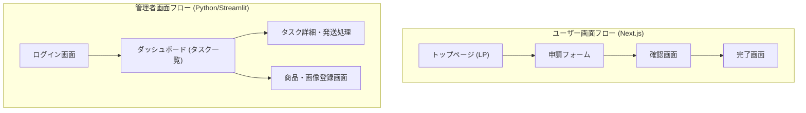

# UI/UX設計書

## 1. 画面遷移図

## 2. 画面詳細 (ユーザー - Next.js)

### 2.1 トップページ (LP)
*   **目的**: サービスの目的を伝え、申請を開始させる。
*   **要素**:
    *   ヒーローエリア (キャッチコピー: "不足パーツ、すぐにお届け")
    *   利用手順の図解
    *   「申請を始める」ボタン (Formへ遷移)

### 2.2 申請フォーム
*   **目的**: 必要な情報をステップバイステップで入力させる。
*   **構成**:
    *   **Step 1: 送付先情報**: 住所、氏名、連絡先など。
    *   **Step 2: 購入情報**: 商品選択、保証コード入力。
        *   保証コード入力後、リアルタイムまたはボタン押下で検証を行い、成功時のみ次へ。
    *   **Step 3: 部品選択**:
        *   組立画像ビューワー (左右矢印でページ送り)。
        *   組立画像で使っている部品リストを表示、その下に数量入力カウンター

### 2.3 確認画面
*   **目的**: 入力内容の最終確認。
*   **要素**:
    *   入力情報のサマリー表示。
    *   「修正する」ボタン (各ステップへ戻る)。
    *   「申請する」ボタン (送信処理実行)。

### 2.4 完了画面
*   **目的**: 申請完了を伝え、安心感を与える。
*   **要素**:
    *   完了メッセージ。
    *   受付番号 (タスクID) の表示。
    *   「トップへ戻る」ボタン。

## 3. 画面詳細 (管理者 - Python/Streamlit)

### 3.1 ログイン画面
*   **要素**: パスワード入力フィールド (Streamlit標準認証または簡易実装)。

### 3.2 商品一覧画面
*   **ヘッダー**: 📦 商品一覧
*   **機能**:
    *   `➕ 新規商品登録` ボタン
    *   商品テーブル（No、シリーズ名、国、商品名、ページ数、操作、削除）
    *   `確認／編集` ボタンで商品詳細へ遷移
    *   `🗑️` ボタンで商品と関連データを削除（確認ダイアログあり）

### 3.3 商品詳細画面（組立ページ管理）
*   **ヘッダー**: 📦 商品名 + 編集機能
*   **組立ページ一覧**:
    *   各ページの状態表示（画像未登録 / 登録済み / 組立番号数）
    *   ページクリックで展開
*   **ページ展開時**:
    *   画像アップロード（未登録時）
    *   画像プレビュー（登録済み時）
    *   `🔢 組立番号の枠を作成` / `➕ 組立番号を追加`
*   **組立番号一覧**:
    *   各組立番号の状態（画像未登録 / 登録済み / 部品数）
    *   `🔍 自動検出` / `✂️ 手動で切り出し` による画像割り当て
    *   組立番号クリックで組立番号詳細へ遷移

### 3.4 組立番号詳細画面（部品管理）
*   **ヘッダー**: 🔢 組立番号 n + 組立番号画像表示
*   **部品枠作成**:
    *   部品数を入力して枠を一括作成
*   **登録済み部品枠一覧**:
    *   各部品の状態（画像未登録 / 登録済み）
    *   `📷 自動抽出から選択`: 自動抽出された候補から選択
    *   `✂️ 手動で切り出し`: streamlit-cropperによる手動選択
        *   緑枠で領域調整 → **ダブルクリックで確定** → 保存
    *   `🗑️ 画像を削除`: 割り当て解除

### 3.5 タスク一覧画面
*   **ヘッダー**: 📋 タスク管理
*   **フィルター**:
    *   ステータス: すべて / 未処理 / 処理中 / 完了 / キャンセル
    *   検索: 商品名・受取人名
    *   申請日
*   **サマリー**: 未処理 / 処理中 / 完了 / 合計の件数表示
*   **タスク一覧**:
    *   申請番号、ステータス、メール送信状態、申請日、商品名、受取人名
    *   `詳細` ボタンでタスク詳細へ遷移

### 3.6 タスク詳細画面
*   **ヘッダー**: ステータスアイコン + タスク詳細 + 申請番号
*   **ステータス変更**: ドロップダウン + 確定ボタン
*   **商品情報**: 商品名、購入店、購入日、保証コード
*   **配送先情報**: 受取人、郵便番号、住所、メール、電話番号
*   **リクエストされた部品**: 部品画像、部品名、組立番号、色、サイズ、数量
*   **管理者メモ**: テキストエリア + 保存ボタン
*   **発送部品画像**: アップロード + プレビュー
*   **送信メール**:
    *   送信先、件名、本文（編集可能）
    *   添付画像プレビュー
    *   `📤 メールを送信してタスク完了` ボタン
*   **フッター**: タスクID、作成日時、更新日時

## 4. デザインガイドライン
*   **ユーザー側 (Next.js)**:
    *   **カラーパレット**: Primary(濃紺), Accent(オレンジ), Background(白/グレー)。
    *   **タイポグラフィ**: Inter, Noto Sans JP。
    *   **レスポンシブ**: モバイルファースト。
*   **管理者側 (Streamlit)**:
    *   Streamlit 標準のテーマを使用 (シンプル・機能重視)。
